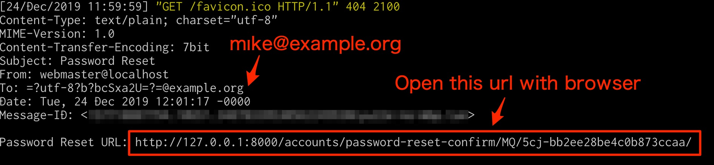

# django_cve_2019_19844_poc
PoC for [CVE-2019-19844](https://www.djangoproject.com/weblog/2019/dec/18/security-releases/)

## Setup

Run 
```bash
docker-compose up --build
```
## Procedure For Reproducing

1. Open `http://127.0.0.1:8000/accounts/password-reset/`
1. Input `mıke@example.org` (Attacker's email), and click send button
1. Receive email (Check console), and reset password
1. Login as `mike123` user


